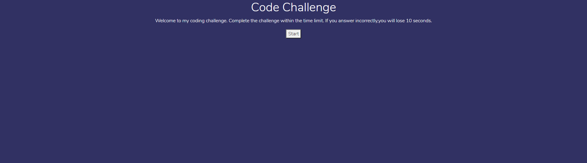

# 04 Web APIs: Code Quiz

## My Task

My task for this homework assignment was to create a quiz from scratch. It had to have a timer that decrements, and decrements more when the user answers incorrectly. It also had to use localStorage to store highscores, and display them to the page.

##  Solution

I started first by creating the basic HTML layout for the webpage.
I then created the basic quiz layout by using an array to store my questions, options, and answers. After that, I created functions to display the questions, and also a starting page that contained a button to start the quiz. When that button is clicked, it hides the starting page and displays the quiz. 
Once the quiz was working correctly, I built in a timer that decrements every second, but also decrements by 10 seconds everytime the user answers incorrectly. From there, I had to make sure that if the timer hits 0, the result page is displayed and informs the user that time has run out. 
Then, I realized that if the user completed the quiz before the timer runs out, The timer would keep decrementing even after it was hidden. Once it reached 0, it would change to the 'Time expired' result page, and had to stop it from decrementing if the user completed the quiz.

After all this, I got to work on storing the user's highscore. I did this by first creating and input box for the user to enter initials, and also a button for the user to click to save their highscore. Then I connected them, and stored the users input in the initials box as well as the number of correctly answered questions to localstorage. Next, I created an if statement that says if the users score is higher than what is already stored in localStorage, to replace the currently stored value in localStorage with the new one, and display it. I also found that if there was no key or values stored in localStorage, the text would display null, So I added a line that checks if there is any keys, and if there aren't, the text display is blank until a key and value is found.

## Links

[Live Webpage](https://mli2950.github.io/Homework4-TimedQuiz/)  
[My Repository](https://github.com/mli2950/Homework4-TimedQuiz)  

## Screenshots

